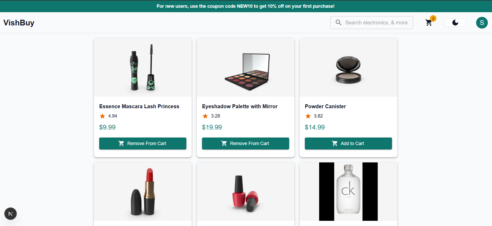

🛒 E-commerce Store (Next.js + DummyJSON)

A fully functional e-commerce web application built with Next.js App Router, Redux Toolkit, and the DummyJSON API. This project demonstrates product listing, category filtering, search, cart system, Firebase authentication, and Stripe payments.

🚀 Features
🔍 Product listing with pagination

📂 Filter by categories

🔎 Search products by name

🛒 Add to cart, update quantity, remove items

🔐 Firebase Authentication (Email & Google Sign-In)

💸 Secure Stripe payments

📦 Checkout stepper with address input

♻️ State management with Redux Toolkit

⚡ Lightning-fast performance with Next.js App Router

✅ Responsive UI with Material-UI

📦 Tech Stack
Next.js 14 (App Router)

React 18

Redux Toolkit for state management

Material UI (MUI) for UI components

DummyJSON API for product data

Firebase Auth (Email & Google)

Stripe for payment gateway

## 🔐 Test Credentials

Use the following credentials to test the authentication features:

### 📧 Email Login

- **Email:** sidd@test.com
- **Password:** Sidd@123

Or, sign in with **Google** using the "Continue with Google" option.

